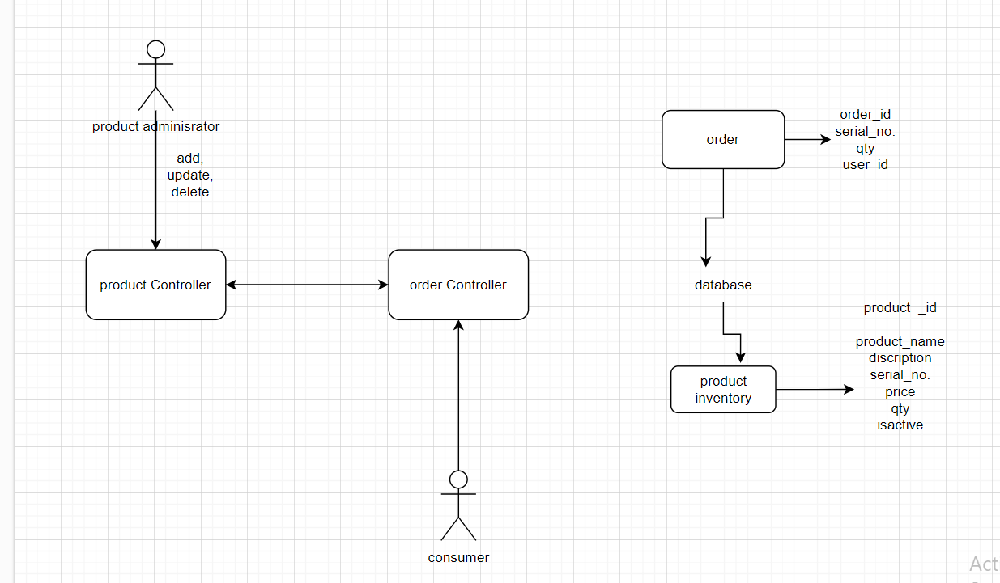

## Description
API_DESIGN DIAGRAM


# BackendExercise
// product controller=> 
// add product API /api/v1/product 
// POST	
//{_id,"name":"", "description":"", "serialNo":number,"price":"", "qty":number}
//this api add new product and serial no. shoud be unique to add product


// product controller=> 
// patch product API /api/v1/product/serialNo/:serialNo
// PATCH	
//{_id,"name":"", "description":"", "serialNo":number,"price":"", "qty":number}
//this api update the product details including increasing qty 
//note=> serial no cannot be change

//delete 
// delete product API /api/v1/product/serialNo/:serialNo

//delete will mark the product as isactive to false
//isactive by default is true 


//GET ALL PRODUCT
//GET api/v1/products?pageSize=10,pageNo=1
// paginated list of product // pageSize=10

//Get product by Id
//api/v1/product/serialNo/:serialNo


//ORDER CONTROLLER

//post api/v1/order
//payload={"serialNo":"","Qty":""}
//validation => 
//serialno should be valid ,
//isactive should be true
//qty > zero and qty(db)  >= QTY(payload)


// folder 
//src => routes => controllers => repository
//routes    => products.js
//            orders.js
//controllers =>products.js =>
//controllers => orders.js
//repository => products.js
//repository => orders.js

API_DESIGN DIAGRAM


## Installation

```bash
$ npm install
```

## Running the app

```bash
# development
$ npm run start

# watch mode
$ npm run start:dev

# production mode
$ npm run start:prod
```

## Test

```bash
# unit tests
$ npm run test

# e2e tests
$ npm run test:e2e

# test coverage
$ npm run test:cov
```

